# Quick Network

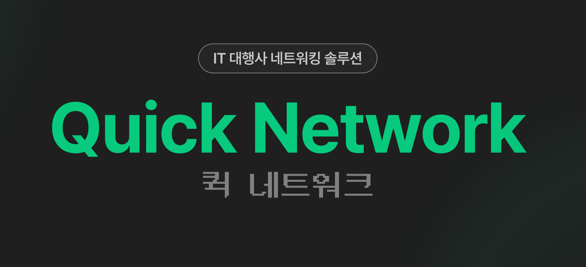

## 🗂 프로젝트 정보

- **프로젝트명**: 퀵 네트워크 서비스 (Quick Network Service)  
- **진행 기간**: 2025.02.24 ~ 2025.04.01  
- **팀원**
  - PM: 최현우
  - PD: 황신혜, 선지현
  - FE: 박지윤, 조은영, 김가영
  - BE: 송준환, 김중환, 박세희

## ✨ 서비스 개요

- 대규모 IT 행사에서 참가자 간 네트워킹의 질을 높이고, 의미 있는 만남과 협업을 유도
- QR 코드 기반 네트워킹 시스템으로 빠르고 효율적인 연결
- 행사장 현장감을 살린 네트워킹 존 구성

---
## 🧑‍💻 나의 역할

<strong>CI/CD 무중단 배포 구축</strong>

**기술 스택**: GitHub Actions, Docker, Nginx, AWS EC2

**구현 내용**:
- GitHub Actions 기반 CI/CD 파이프라인 구축
- Blue-Green 배포 전략 적용으로 무중단 서비스 운영
- curl + X-DEPLOY-TOKEN 방식으로 현재 활성 서버 판별
- 반대편 서버에 신규 애플리케이션 배포 → Health Check → Nginx 트래픽 전환 → 이전 서버 정리

**⚠️ 주요 이슈**  
- 배포 시 트래픽 손실 없이 안전하게 서버 전환하는 방법  
  → Blue-Green 전략 + Nginx 설정 변경으로 해결  
- 보안성을 위해 `X-DEPLOY-TOKEN` 헤더 인증 적용

<strong>테이블 기능 구현</strong>

**기술 스택**: Spring Boot, JPA, MySQL

**구현 내용**:
- 테이블 CRUD 및 자동 배정 기능 구현
- QR 코드 스캔을 통해 세션 시작 → 사용 시간 관리
- 세션 종료는 타이머 기반 자동 종료 또는 수동 종료 버튼 처리
- 테스트 코드 작성

**⚠️ 주요 이슈**  
- 동일 테이블에 여러 요청이 몰리는 동시성 문제  
  → 비관적 락(Pessimistic Lock)을 사용하여 트랜잭션 안전성 확보  
- 세션 자동 종료를 위한 타이머 비동기 처리 설계

<strong>테이블 예약 시스템 구현</strong>

**기술 스택**: Spring Boot, WebSocket, Redis

**구현 내용**:
- 채팅방 내 테이블 예약 기능 구현
- 빈 테이블 → 즉시 배정 / 없을 경우 → 대기열 등록
- 대기열 상태 및 예상 소요 시간 실시간 안내

**⚠️ 주요 이슈**  
- 실시간으로 대기열 정보를 프론트에 전달하는 방법  
  → WebSocket 브로드캐스트로 클라이언트 전체에 실시간 전파

<strong>온라인 명함 시스템 구현</strong>

**기술 스택**: Spring Boot, JPA, QR Code

**구현 내용**:
- 명함 도메인 설계 및 CRUD API 구현
- QR 코드 기반 명함 교환 → 자동 저장
- 마이페이지에서 내 명함 / 저장된 명함 열람 가능

**⚠️ 주요 이슈**  
- 명함 중복 저장 및 교환 시점 동기화  
  → 명함 스캔 시 사용자간 중복 방지 로직 적용

<strong>시스템 모니터링 구축</strong>

**기술 스택**: Prometheus, Grafana, Spring Actuator

**구현 내용**:
- 어플리케이션 및 서버 상태 모니터링 대시보드 구축
- 네트워킹 세션, 테이블 사용률 등 커스텀 메트릭 수집 및 시각화

**⚠️ 주요 이슈**  
- 운영 중인 기능별 상태를 실시간으로 확인할 방법  
  → Prometheus Exporter + Grafana 대시보드로 실시간 모니터링 가능

## 🧱 시스템 아키텍처

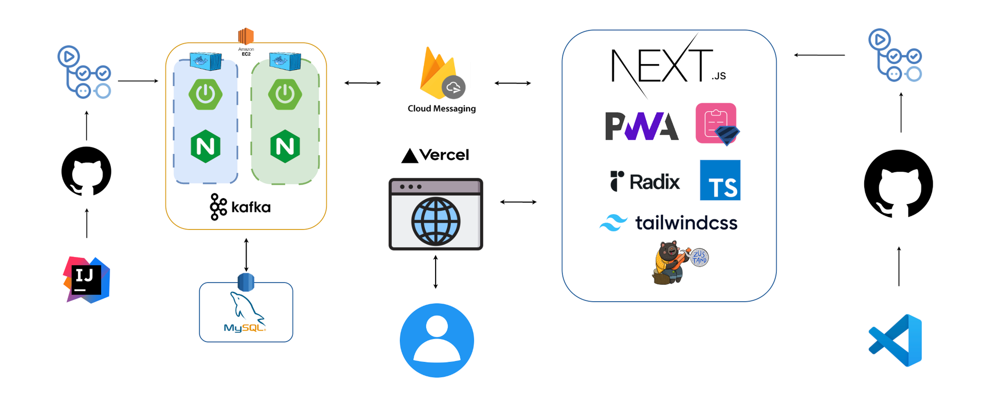  

## 📊 시스템 플로우차트

---

## 🎬 주요 기능별 데모

<strong>사전 등록</strong>

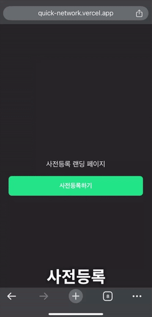

- 참가자는 행사 전 웹을 통해 사전 등록을 진행
- 닉네임은 자동 생성되며, 등록 완료 시 QR 코드 발급
- 개인정보 수집 동의 절차 포함

<strong>PWA 생성</strong>

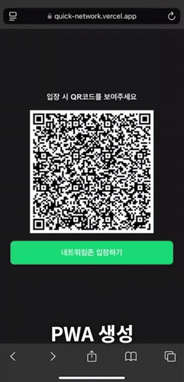

- 설치 없이 모바일 환경에서도 앱처럼 실행 가능
- 디바이스별 FCM 토큰을 받아 푸시 알림 수신 가능

<strong>네트워킹 존 입장</strong>

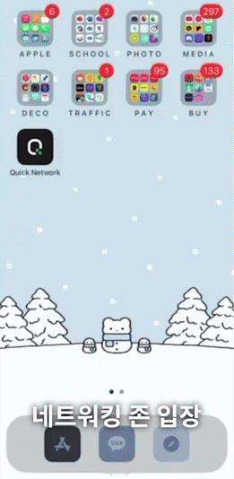

- 사전 등록 시 생성된 계정 정보로 네트워킹 존에 입장 가능

<strong>명함 교환</strong>

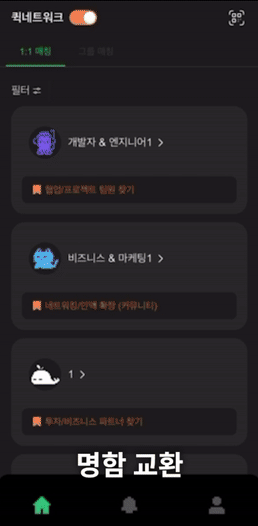

- 참가자 간 QR 코드를 스캔하여 명함 자동 교환
- 교환된 명함은 마이페이지에서 확인 가능

<strong>내 정보 수정</strong>

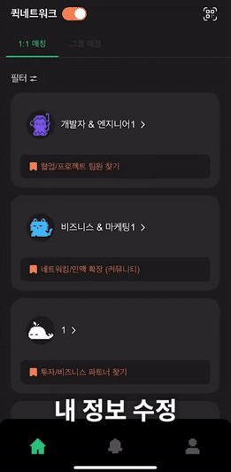

- 닉네임, 직무, 관심 분야 등 사용자 정보 수정 가능
- 변경 사항은 명함 및 매칭 시스템에 실시간 반영

<strong>내 명함 보기</strong>

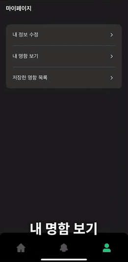

- 내 정보 기반 QR 명함 확인 뷰 제공
- 다른 사용자에게 명함을 보여줄 때 사용

<strong>저장한 명함 목록</strong>

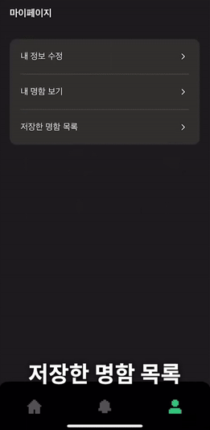

- 교환된 명함은 자동 저장
- 리스트 형태로 열람 및 관리 가능

<strong>1:1 매칭 (신청자)</strong>

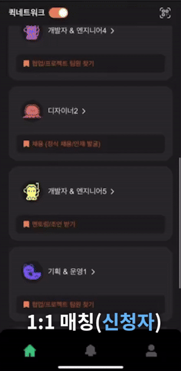

- 참가자는 관심 있는 사람에게 매칭 요청 가능
- 요청 시 상대방에게 실시간 푸시 알림 전송

<strong>1:1 매칭 (수신자)</strong>

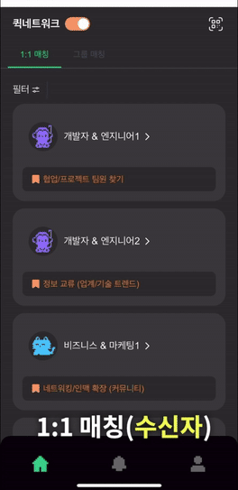

- 수신자는 수락 여부 선택 가능
- 수락 시 자동으로 채팅방 생성

<strong>테이블 신청</strong>

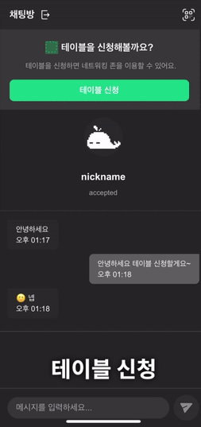

- 빈 테이블이 있을 경우 즉시 배정
- 만석일 경우 대기열에 자동 등록

<strong>테이블 QR 인식</strong>

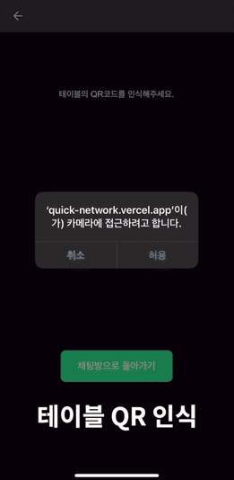

- 테이블에 부착된 QR을 스캔하여 세션 시작
- 서버에 스캔 정보가 전달되어 상태 변경 처리

<strong>네트워킹 진행</strong>

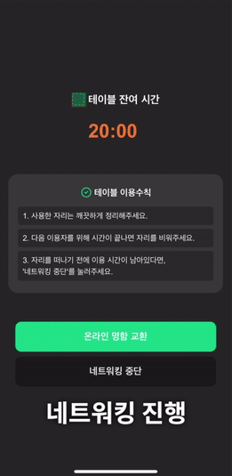

- 테이블에서 자유롭게 대면 네트워킹 진행
- 명함 교환 및 대화 가능

<strong>네트워킹 종료</strong>

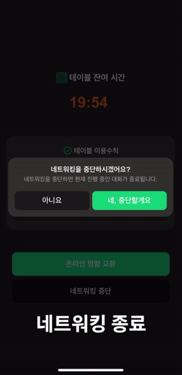

- 세션 시간이 만료되면 자동 종료
- 테이블은 다음 사용자에게 재배정 가능 상태로 전환

<strong>그룹 만들기</strong>

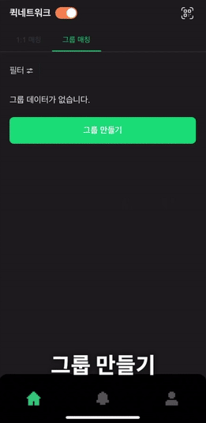

- 최대 4인의 그룹 생성 가능
- 관심 분야, 경력 기반으로 그룹 생성

<strong>그룹 매칭</strong>

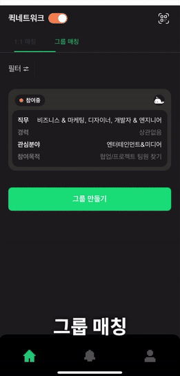

- 그룹 매칭 완료 시 자동 그룹 채팅방 생성
- 그룹 단위로 테이블 신청 가능

